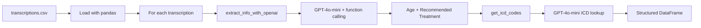

# Organizing Medical Transcriptions with the OpenAI API

Automate extraction of structured clinical data from free-text medical transcriptions and map treatments to **ICD-10 codes** using the OpenAI API.

Built for a scenario at **Lakeside Healthcare Network**, where clinical teams need to turn dense, narrative patient encounter notes into structured records suitable for billing, insurance claims, and downstream documentation.


---

## Overview

Medical professionals often summarize patient encounters in natural-language transcripts that include symptoms, diagnoses, and treatment plans. Manually pulling out key fields—patient age, recommended procedures, and billing codes—is slow and error-prone.

This project uses **GPT-4o-mini** with OpenAI **function calling** to:

1. **Extract** patient age and recommended treatment/procedure from each transcription
2. **Enrich** each record with the original medical specialty
3. **Resolve** ICD-10 codes for the recommended treatment
4. **Output** a clean, structured pandas DataFrame ready for export or analysis

---

## Features

| Capability | Description |
|---|---|
| Structured extraction | Uses OpenAI tool/function calling to return typed JSON (`Age`, `Recommended Treatment/Procedure`) |
| ICD-10 mapping | Prompts the model to return ICD codes for each extracted treatment |
| Specialty preservation | Carries forward the source `medical_specialty` from the dataset |
| Graceful fallbacks | Returns `"Unknown"` when age or treatment cannot be determined |
| Batch processing | Iterates over all rows in `transcriptions.csv` and builds a unified output table |

---

## Project Structure

```
.
├── README.md
├── .gitignore
└── workspace/
    ├── notebook.ipynb              # Main project notebook
    ├── data/
    │   └── transcriptions.csv      # Anonymized sample transcriptions
    ├── electronic_medical_records.png
    └── images/                     # Setup reference screenshots
```

---

## Dataset

**File:** `workspace/data/transcriptions.csv`

| Column | Description |
|---|---|
| `medical_specialty` | Clinical specialty associated with the transcription (e.g., Orthopedic, Urology) |
| `transcription` | Full anonymized medical note text |

The sample dataset includes **5 transcriptions** across specialties:

- Allergy / Immunology
- Orthopedic
- Bariatrics
- Cardiovascular / Pulmonary
- Urology

> **Note:** All patient data in this repository is anonymized and intended for educational/demo purposes only.

---

## How It Works



### Step 1 — Extract clinical fields

`extract_info_with_openai()` sends each transcription to the OpenAI Chat Completions API with a system prompt and a defined tool schema:

- **Age** (integer)
- **Recommended Treatment/Procedure** (string)

If a field is missing from the note, the model is instructed to return `"Unknown"`.

### Step 2 — Resolve ICD-10 codes

`get_icd_codes()` takes the extracted treatment and asks the model to return a list of relevant ICD-10 codes. Treatments marked `"Unknown"` skip the API call and return `"Unknown"`.

### Step 3 — Build structured output

Each processed row includes:

| Field | Source |
|---|---|
| `Age` | Extracted via function calling |
| `Recommended Treatment/Procedure` | Extracted via function calling |
| `Medical Specialty` | From original CSV |
| `ICD Code` | Generated from treatment |

---

## Prerequisites

- **Python 3.9+**
- An [OpenAI account](https://platform.openai.com/) with billing enabled
- An OpenAI API key with access to **GPT-4o-mini**
- [Jupyter Notebook](https://jupyter.org/) or [JupyterLab](https://jupyterlab.readthedocs.io/)

---

## Setup

### 1. Clone the repository

```bash
git clone https://github.com/farhanlabib956/Organizing-Medical-Transcriptions-with-the-OpenAI-API.git
cd Organizing-Medical-Transcriptions-with-the-OpenAI-API
```

### 2. Create a virtual environment (recommended)

```bash
python -m venv venv

# Windows
venv\Scripts\activate

# macOS / Linux
source venv/bin/activate
```

### 3. Install dependencies

```bash
pip install pandas openai jupyter
```

### 4. Configure your OpenAI API key

Set your API key as an environment variable so the notebook can initialize the client with `OpenAI()`:

**Windows (PowerShell)**

```powershell
$env:OPENAI_API_KEY = "your-api-key-here"
```

**macOS / Linux**

```bash
export OPENAI_API_KEY="your-api-key-here"
```

Alternatively, create a `.env` file locally (already excluded by `.gitignore`):

```
OPENAI_API_KEY=your-api-key-here
```

> Never commit API keys to version control.

Reference screenshots for OpenAI account setup are available in `workspace/images/`.

---

## Running the Notebook

1. Activate your virtual environment
2. Start Jupyter from the `workspace` directory:

   ```bash
   cd workspace
   jupyter notebook
   ```

3. Open **`notebook.ipynb`**
4. Run all cells in order:
   - Imports and data loading
   - OpenAI client initialization
   - Extraction and ICD mapping functions
   - Batch processing loop

5. Inspect the final **`df_structured`** DataFrame for results

---

## Example Output

After processing, `df_structured` contains one row per transcription:

| Age | Recommended Treatment/Procedure | Medical Specialty | ICD Code |
|---|---|---|---|
| 23 | Zyrtec / loratadine; Nasonex nasal spray | Allergy / Immunology | *(model-generated ICD-10 codes)* |
| 41 | Operative fixation of Achilles tendon rupture | Orthopedic | *(model-generated ICD-10 codes)* |
| … | … | … | … |

Exact ICD codes vary by model response. For production billing workflows, always validate codes against an authoritative ICD-10 reference.

---

## Models & API Usage

| Setting | Value |
|---|---|
| Model | `gpt-4o-mini` |
| Extraction | Chat Completions with `tools` (function calling) |
| ICD lookup | Chat Completions with `temperature=0.3` |

**Cost note:** This notebook makes **two API calls per transcription** (one for extraction, one for ICD lookup). With 5 sample rows, that is 10 calls total. Monitor usage on your [OpenAI usage dashboard](https://platform.openai.com/usage).

---

## Important Disclaimers

- This project is for **educational and demonstration purposes** only.
- AI-generated extractions and ICD codes are **not a substitute** for review by qualified healthcare professionals or certified medical coders.
- Do not use this tool for real patient care, billing, or compliance decisions without appropriate validation and oversight.
- Ensure compliance with **HIPAA**, local privacy laws, and your organization's data handling policies before processing any real PHI.

---

## Troubleshooting

| Issue | Solution |
|---|---|
| `AuthenticationError` | Verify `OPENAI_API_KEY` is set correctly |
| `RateLimitError` | Add delays between rows or reduce batch size |
| Empty tool calls | Check that the transcription text is non-empty |
| File not found for CSV | Run Jupyter from the `workspace/` directory |
| High API costs | Process a subset of rows first; cache intermediate results |

---

## License

This repository is provided as-is for learning purposes. Review OpenAI's [Terms of Use](https://openai.com/policies/terms-of-use) and [Usage Policies](https://openai.com/policies/usage-policies) when working with medical content.

---

## Author

**Farhan Labib** — [GitHub](https://github.com/farhanlabib956)
